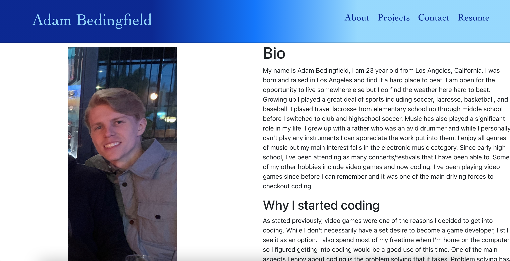
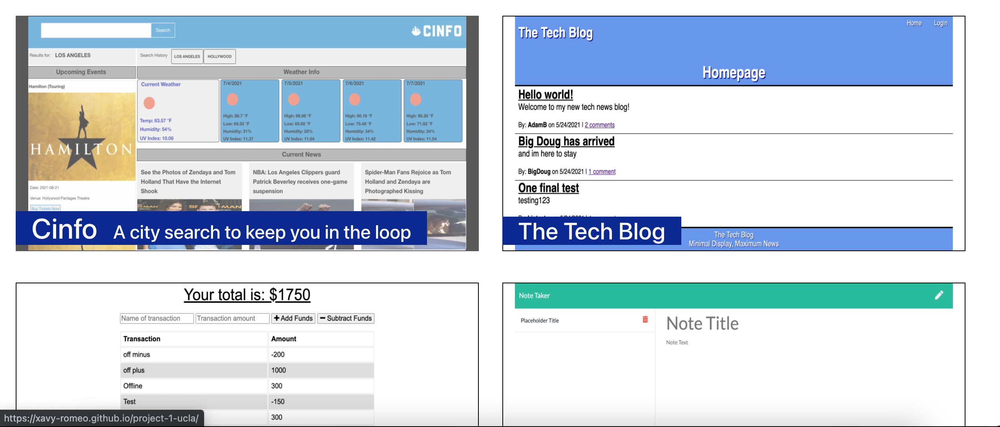
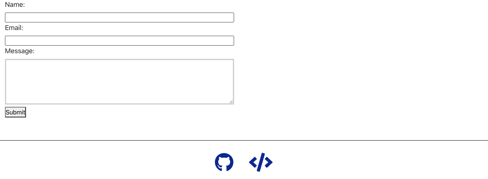

# My Portfolio 
## Description 
This is my own personal portfolio. It contains information about me, my projects, my proficiencies, and a way to contact me. 
## Deployed app
Deployed with github pages. 
https://adambedingfield.github.io/about 
## Table of Contents 
* [About](#about) 
* [Projects](#projects) 
* [Contact](#contact) 
* [Resume](#resume) 
* [Technology](#technology) 
* [Questions](#questions) 
## About 
Upon landing on the page you will be taken to the home/about page. This page includes a short biography about me, a photo of me, and a few reasons I decided to get into coding. The header is also shown with a navigation bar to checkout different sections. 

About page and Header 
 

## Projects 
Clicking on projects will take you to a project spotlight of my past work. Their names are listed and a short description of the project will be displayed on hover. These can all be clicked to link to their respective websites. 

Project Page 
 

## Contact 
Clicking on the Contact section will bring up fields to input your name, email, and a message to send to me. All fields are required and the email field has validation. At the bottom of each page is a footer that links to my github and this portfolios repo. 

Contact Page and Footer 
 

## Resume 
Last is the resume page. I've listed my front-end,back-end, and development skills on this page and there is a link at the top to download this list in a .txt file format. 

Resume Page 
 

## Technology 
React 
Javascript 
CSS 
HTML 
Github Pages 
NPM 
Bootstrap 
React Router 

## Questions 
GitHub: https://github.com/adambedingfield 
Email: adamcbedingfield@gmail.com 